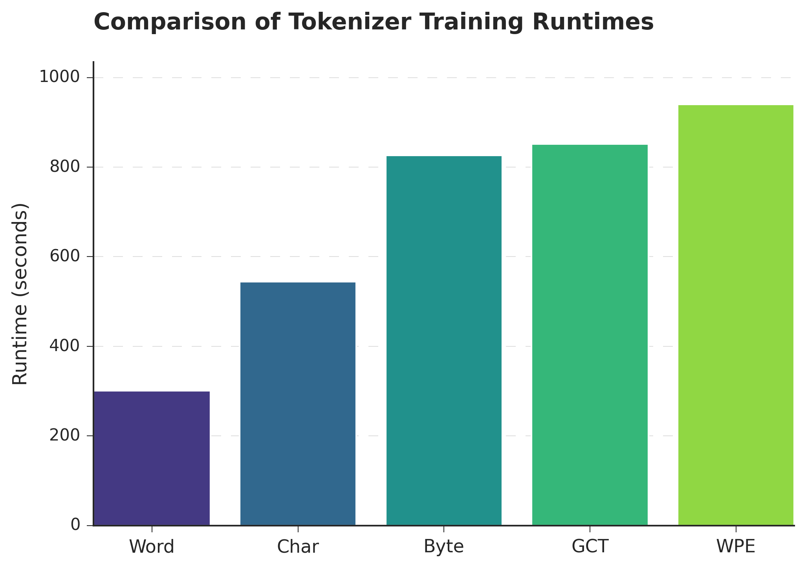

# A Comparative Analysis of Tokenization Methods for Sinhala NLP

This repository contains the analysis and findings for the paper, "A Comparative Analysis of Tokenization Methods for Sinhala Natural Language Processing." This research systematically evaluates the impact of different tokenization strategies on the performance, robustness, and efficiency of Transformer-based models for the Sinhala language.

---

##  Goal

For low-resource and morphologically complex languages like Sinhala, the choice of tokenizer is a critical but underexplored decision. This project aims to answer the following research question:

> **What is the optimal tokenization strategy for Sinhala NLP, considering the trade-off between model performance, robustness to textual noise, and computational efficiency?**

To answer this, we evaluate five tokenization methods across four distinct datasets designed to simulate real-world conditions, from clean, formal text to noisy, user-generated content.

---

## Methodology Overview

* **Tokenizers Evaluated:**
    1.  **Word-Level**: Splits by space and punctuation.
    2.  **WordPiece (WPE)**: A subword method used by BERT.
    3.  **Grapheme Cluster (GCT)**: Splits into linguistically correct "perceived" characters.
    4.  **Character-Level**: Splits into individual Unicode characters.
    5.  **Byte-Level**: Splits into raw UTF-8 bytes.

* **Datasets:**
    * **Original**: Clean, baseline text.
    * **Minor Typos**: Text with a 5% character error rate.
    * **Aggressive Typos**: Text with a 10% character error rate.
    * **Mixed Coding**: Text with minor typos and Romanized "Singlish."

* **Model:** A Transformer encoder-based classification model trained from scratch for each of the 20 experiments (5 tokenizers x 4 datasets).

---

## Key Findings

Our analysis reveals a clear trade-off between performance, robustness, and computational cost.

1.  **Performance vs. Robustness**: Word-level tokenization is the best performer on clean text but is brittle and fails on noisy data. **WordPiece (WPE)** offers superior robustness, making it the most reliable choice for real-world applications.

2.  **Performance Stability**: WordPiece maintains consistently high performance across all data conditions (low standard deviation), while Word-level and Grapheme Cluster performance is more sensitive to data quality.

3.  **The Efficiency Trade-Off**: There is a stark inverse relationship between training speed and robustness. The fastest tokenizer (Word-level) is the least robust, while the most robust (WordPiece) is the most computationally expensive.

### Performance Summary

| **Dataset** | **Byte** | **Char** | **GCT** | **Word** | **WPE** |
| :------------------------- | :------- | :------- | :------- | :--------------- | :--------------- |
| Original                   | 0.6580   | 0.6671   | 0.7073   | **0.7274** | 0.7100           |
| Minor Typos                | 0.6566   | 0.6651   | 0.7007   | **0.7044** | 0.7000           |
| Aggressive Typos           | 0.6604   | 0.6785   | 0.6987   | 0.6884           | **0.7000** |
| Mixed Coding               | 0.6468   | 0.6526   | 0.6528   | **0.6779** | 0.6776           |
| **Std. Dev. (across tasks)** | 0.0060   | 0.0106   | 0.0250   | 0.0215           | 0.0142           |

### Training Time Comparison



---

## Conclusion & Recommendations

* **For speed and clean data**: Use **Word-level** tokenization.
* **For maximum robustness on real-world data**: Use **WordPiece (WPE)**.
* **For a balance between robustness and efficiency**: Use **Grapheme Cluster (GCT)**.

---

## Citation

If you find this work useful in your research, please consider citing our paper:

```bibtex
@article{ravihara2025tokenization,
  title={A Comparative Analysis of Tokenization Methods for Sinhala Natural Language Processing},
  author={Ravihara, Ransaka},
  year={2025}
}
```

---

## License

This project is licensed under the MIT License. See the `LICENSE` file for details.
